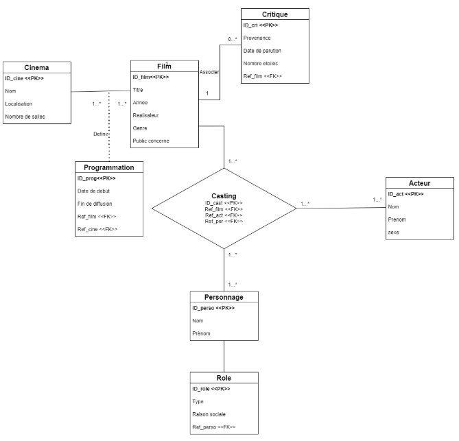

# Mini-Projet de Programmation Objet et Langage Java 

## Objectif

Le programme modélise une colonie de robots autonomes répartis sur une zone minière d’une planète éloignée. Les robots explorent le sol grâce à un capteur leur permettant de connaître la teneur en minerai à la verticale de leur position. L’objectif est de trouver la stratégie de recherche optimale conduisant à la découverte de la position la plus fructueuse.

Le projet se déroule en 3 séances de TP, réparties sur trois parties. Un diagramme UML est fourni pour décrire l’ensemble des classes utilisées dans ce projet.


## Partie A. Modélisation de la Zone Minière

### 1. Classe Point
La zone de recherche est définie par la région du plan délimitée par des valeurs (x, y) comprises entre 0 et 1.

**Méthodes à implémenter :**
- `Constructeur vide` : Attribue des coordonnées arbitraires à l'aide d'un attribut statique `random`.
- `Constructeur avec deux arguments (abscisse, ordonnée)` : Initialise les coordonnées du point.
- `distance(Point p)` : Calcule la distance Euclidienne entre le point courant (`this`) et un autre point `p`.
- `move(Point cible, double d)` : Déplace le point courant vers un autre point en tenant compte de la distance maximale `d`.

<p align="center">
  
</p>


### 2. Cartes des Teneurs en Minerai
À une position donnée `P` correspond une teneur en minerai sur la carte, modélisée par une interface `AbstractProblem` avec la méthode `double teneur(Point position)`.

**Problèmes à modéliser :**
- **Classe `Sphere`** : Fonction de test `T=1-(a²+b²)/2`.
- **Classe `Eggholder`** : Fonction de test avec des valeurs minimales et maximales spécifiques.

La teneur doit être normalisée entre 0.0 et 255.0.

<p align="center">
  
</p>

### 3. Visualisation
Utilisez la classe `Viewer` pour afficher la carte de minerai en fausses couleurs, allant du bleu (teneur proche de 0) au rouge (teneur proche de 255).

## Partie B. Modélisation de la Colonie de Robots

### 4. Classe Robot
Le robot possède une position courante `P`, une position locale `L` où il a trouvé le maximum de teneur, ainsi qu'une teneur actuelle et la meilleure teneur obtenue.

**Comportements à définir :**
- Le robot a un attribut `behavior` (type `Behavior`) pour déterminer son comportement (exploration locale, regroupement global, etc.).
- **Méthode `walk`** : Déplace le robot en fonction du comportement.

<p align="center">
  
</p>

### 5. Classe Behavior
Cette classe définit un comportement de base, où le robot effectue une marche aléatoire pour explorer le terrain.

**Méthodes :**
- `move(Robot robot)` : Déplace le robot selon une orientation aléatoire.

### 6. Classe BasicMission
Gère la colonie de robots et leur exploration d'un gisement.

**Méthodes :**
- **`run()`** : Effectue des itérations dans lesquelles les robots collectent des données, se déplacent et mettent à jour leur position.
- **`collect()`** : Met à jour la teneur récoltée par les robots.
- **`store()`** : Enregistre les positions des robots dans un fichier.

### 7. Stratégies de Recherche
Implémenter différentes stratégies de comportement comme `Follow` et `LocalBest` pour que les robots puissent explorer en suivant la meilleure position globale ou locale.

## Partie C. Introduction de Politiques de Recherche

### 8. Classe AbstractPolicy
Cette classe définit les stratégies de recherche en plusieurs phases, chacune avec un comportement et une durée spécifiques.

**Méthodes :**
- `getBehaviorForPhase(int phase)` : Renvoie le comportement pour la phase donnée.
- `getDurationForPhase(int phase)` : Renvoie la durée de la phase.

### 9. Classe SimplePolicy
Cette classe implémente une politique de recherche simple avec plusieurs phases ayant des comportements et durées variables.

**Exemple :**
	```java

	SimplePolicy policy = new SimplePolicy(3);
	policy.add(new Behavior(), 60);
	policy.add(new LocalBest(), 20);
	policy.add(new Follow(), 20);
	```


### 10. Classe SmartMission
Cette classe étend BasicMission et utilise un objet AbstractPolicy pour déterminer les comportements des robots au cours de l'exploration.

Méthodes :

run() : Exécute les itérations avec les comportements définis par la politique de recherche.

<p align="center">
  
</p>
<p align="center">
  
</p>


## L'autre dossier enregistre les codes des autres sujets


## Base de donnees et l'application java

Ce projet visait à concevoir et mettre en œuvre une base de données en utilisant le langage SQL. Nous avons d'abord appris les concepts fondamentaux des bases de données, puis conçu le modèle relationnel avec UML. Après avoir établi la structure de la base, nous avons pratiqué le SQL avec SQLite pour réaliser des requêtes et manipuler les données.

La dernière étape a consisté à intégrer la base de données avec une application Java, illustrant son utilisation dans une Interface Homme-Machine. L'objectif était de comprendre les principes de conception des bases de données et leur intégration dans des applications réelles.


<p align="center">
  
</p>
<p align="center">
  
</p>
